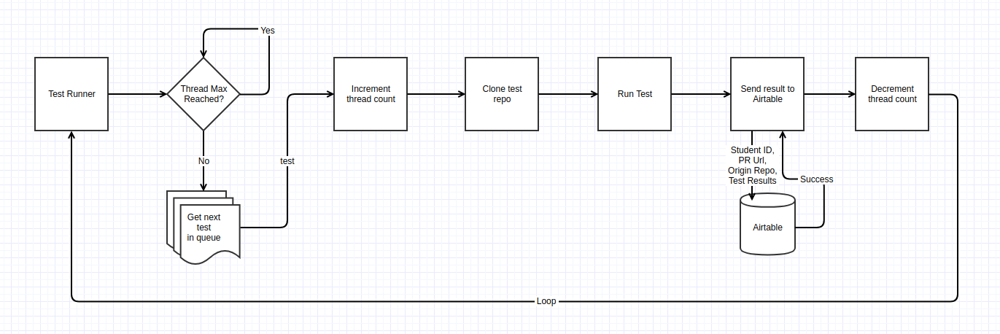

## Description
* A PR submission test runner for Lambda School that automatically tracks PR submissions for sprints using Github API. Once a PR is submitted the test runner will clone down the repo and run the repos tests.  The results are sent off to be stored in the student database using Airtable API.


## Routes

### Post

`POST /new-test`

#### Request Body
```
{
  pull_request: {
    head: {
      repo: {
        id: 117150153,
        html_url: 'https://github.com/dys2/DYS2-hooks'
      }
    }
  }
}
```
#### Response
```
{
  success: true
}
```
 ## Test Runner
 

## Local Environment Setup
* Run `ngrok http 3434` in terminal
* Copy ngrok url from terminal and enter is as Payload URL in the webhook setup in Github
* `npm start`